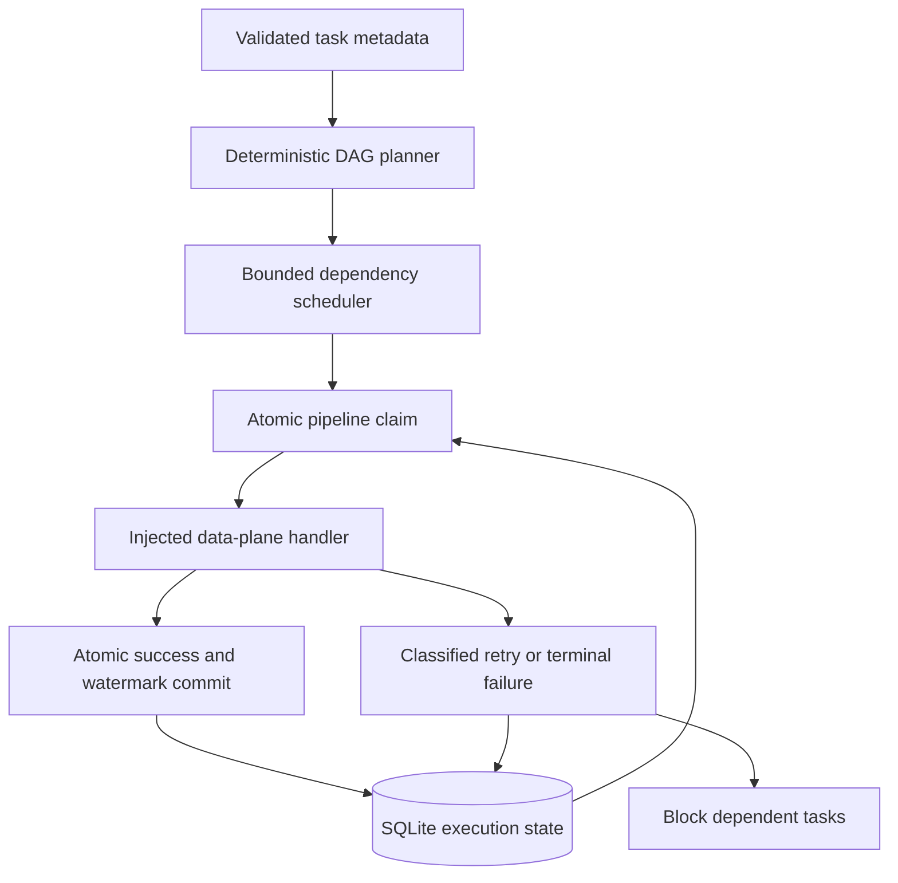

# Metadata Lakehouse Orchestrator

A metadata-driven DAG executor backed by SQLite. The implementation is local;
the design question is how ownership and progress survive retries and partial failure.

## Why I built this

Retries look straightforward until they interact with dependencies, concurrent runs
and incremental checkpoints. I wanted a small system where I could interrupt that
sequence and inspect what the next attempt is allowed to do. This project puts the
work into orchestration state and ownership rather than inventing another pipeline
syntax.

## Invariants before scheduling

1. One pipeline has one active owner in a shared local state store.
2. A child runs only after all parents have recorded success, including a replay skip.
3. Failed attempts do not advance the checkpoint; success and its watermark commit together.
4. Reusing a logical run with different metadata or a different window is an error.

These are control-plane guarantees. They do not make an external sink write atomic
with the state store. [ADR-002 explains why orchestration state lives outside the task handler](docs/ADR-002-state-ownership.md),
and what the handler still has to guarantee.

## Execution model



- Graph validation rejects missing dependencies, cycles, duplicate names/dependencies
  and invalid duration estimates. Topological order is stable; critical path is a
  dependency lower bound, not a prediction under resource contention.
- Up to `max_workers` independent tasks run concurrently. Children start only after
  all parents succeed or are skipped as already successful. Independent branches continue.
- A transaction claims each pipeline across processes sharing one local database.
  Another run receives BUSY rather than executing the same pipeline concurrently.
- A logical identity is `(run_id, pipeline)`; a definition fingerprint prevents reuse
  with a different configuration or watermark window.
- Each handler receives a fixed integer range `(watermark_before, watermark_after]`.
  The cursor represents a synthetic monotonic source offset, not an event-time clock.
- Success and watermark advancement commit in the same SQLite transaction. Failed
  attempts preserve the old watermark. Durable audit events capture attempts and skips.
- Only `RetryableError` triggers bounded exponential retries. Permanent errors fail
  immediately. Metadata classifies workloads for a future backend; classification
  currently does not reserve CPU, prioritize queues or choose cloud compute.

## Failure semantics

| Failure | Result |
| --- | --- |
| Invalid graph/configuration | No task starts |
| Transient handler error | Retry same window; bounded backoff |
| Permanent error or exhausted retries | FAILED, checkpoint unchanged, descendants BLOCKED |
| Concurrent pipeline owner | BUSY; descendants BLOCKED |
| Crash with active claim | Claim remains; operator recovery required |
| State commit fails after side effect | Claim retained; reconcile sink before recovery |
| Reuse run ID with changed metadata | Rejected |

**Exactly-once side effects are not guaranteed.** A worker can finish a sink write and
crash before recording success. Handlers must merge/upsert or deduplicate using a stable
business key or `(run_id, pipeline)`. Retrying alone does not make a sink idempotent.

A successful same-run replay is skipped. If a failed window has been superseded by
another run's watermark, it cannot be replayed under the old identity. Do not reuse a
run ID for a new graph or different handler implementation: the fingerprint covers
metadata, not Python handler code.

## Try a run, then replay it

Python 3.11–3.13:

```bash
python -m venv .venv
# Activate: Windows .venv\Scripts\Activate.ps1; POSIX source .venv/bin/activate
python -m pip install -r requirements-dev.lock.txt
python -m pip install -e . --no-deps
python -m pytest -q
python demo.py
python demo.py
```

The first demo creates ignored `out/control.db`, runs the four synthetic pipelines,
and persists watermark 100. The second skips all successful tasks. The graph's critical
path is 17 minutes of configured estimates; the handlers themselves perform no ETL.
Use a new run ID and greater upper watermark for a new incremental window.

Tests cover retries, restarts, durable watermarks, simultaneous claims, parallel branches,
blocked descendants, explicit recovery and incompatible replay. CI also checks lint,
formatting and the demo across three Python versions.

## Operating this version

Audit events expose pipeline, run ID, attempt and status without storing exception
messages or source records. JSON success events are emitted through Python logging.
See [runbook](docs/runbook.md), [state decision](docs/ADR-001-idempotency.md) and
[control schema](sql/control_tables.sql).

SQLite provides inspectable local transactions and serialized state writes; it is not
a distributed scheduler database and should not live on a network filesystem. The
scheduler is one process with threads; it does not interrupt hung handlers or provide
leases/heartbeats. Claims require explicit recovery after the old worker is stopped.
I would establish fenced ownership before adding remote workers. The
[future-work plan](FUTURE_WORK.md) starts with a Postgres state backend, then fenced
leases and durable dispatch; none of those capabilities is present yet.

An independent clean-room implementation with synthetic offsets and workloads.
No employer code or confidential data is used, and no production deployment is claimed.
